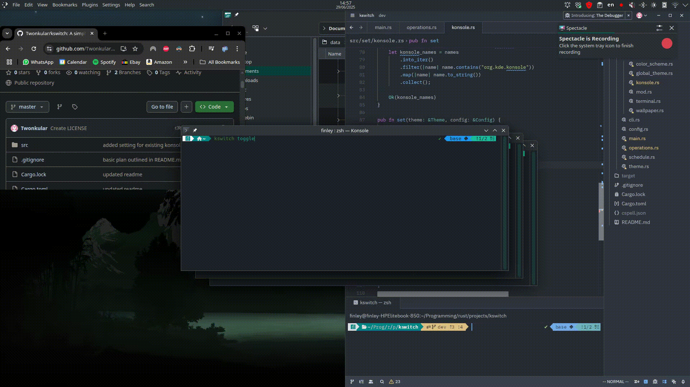

# kswitch

A simple command line tool for light/dark theme switching in KDE Plasma.



## Features

- Command line interface to set or toggle theme
- Easy to configure a keyboard shortcut — just make a keyboard shortcut for `kswitch toggle`
- Configurable through a simple config file (`~/.config/kswitch/config.toml` by default)
- Switches Konsole default theme and also updates theme for all open Konsole instances
- Synchronous, multithreaded design for smoother transitions

## Installation Instructions

### Dependencies

- KDE Plasma (tested on 6.3.5)
- `dbus` and `qdbus` for interfacing with KDE components
- Rust (for building from source)
- `cargo` for installation

### From Source

```sh
git clone https://github.com/yourusername/kswitch
cd kswitch
cargo install --path .
```

## Usage

```sh
kswitch toggle         # Toggle between light and dark themes
kswitch set light      # Force light mode
kswitch set dark       # Force dark mode
kswitch config edit    # Open config in your default editor
```

You can create a custom keyboard shortcut in KDE System Settings to run `kswitch toggle`.

## Configuration

`kswitch` uses a simple TOML config file located at:

```
~/.config/kswitch/config.toml
```

It includes paths and names of your preferred themes, wallpapers, etc. The config can be created or edited via:

```sh
kswitch config edit
```

## Warnings

- Currently tested only on **KDE Plasma 6.3.5** (Manjaro Linux).
- Functionality may vary or break on other Plasma versions or KDE-based environments.
- Use at your own risk and backup your theme settings.

## Tasks

- [x] CLI interface
- [ ] Set
    - [x] Global Theme
    - [x] Terminal
        - [x] Set default theme in `.config/konsolerc`
        - [x] Set theme for existing terminal windows via D-Bus
    - [x] Color Scheme
    - [x] Wallpaper
    - [ ] Cursor Theme
    - [ ] Kvantum engine theme (for Qt apps)
    - [x] Environment variable setting to track light/dark state
- [x] Get
    - [x] Current state from environment variable
    - [x] Default theme based on time and config
- [x] Set Themes
    - [x] Light
    - [x] Dark
- [x] Toggle
- [x] Config
    - [x] Config struct
        - [x] Read from file
        - [x] Save to file
        - [x] Edit via default editor
    - [x] Auto-create at default location
- [ ] Add support for user-defined scripts:
    - `~/.config/kswitch/light/`
    - `~/.config/kswitch/dark/`
    - [ ] create directories if empty
    - [ ] populate list of files to run on switch
    - [ ] execute files on switch

## Future Improvements

- [ ] Interactive configuration tool
- [ ] Improve speed of synchronous switching
- [ ] Prioritize visible windows during theme switch
- [ ] Implement timed changes via `systemctl` and `systemd` timers
- [ ] Create custom wallpaper plugin using QML/Plasmoid for transition effects
- [ ] Allow disabling individual features (e.g., don't change wallpaper)
- [ ] Replace binary dependencies with full D-Bus control
- [ ] Automatic scheduling based on user config
- [ ] Sunrise/sunset-based scheduling using [`sunrise`](https://crates.io/crates/sunrise)

## License

MIT License. See `LICENSE` file for details.

## Contributions

Feel free to open issues or submit pull requests. Cannot promise I will look at them. Did this for myself to help learn Rust.

## Existing solutions

Take a look at [koi](https://github.com/baduhai/Koi) and [YinYang](https://github.com/oskarsh/Yin-Yang). These do similar things, but there is no way to create a keyboard shortcut in Koi, and YinYang feels slow. Neither offer theme switching on Konsole sessions.
